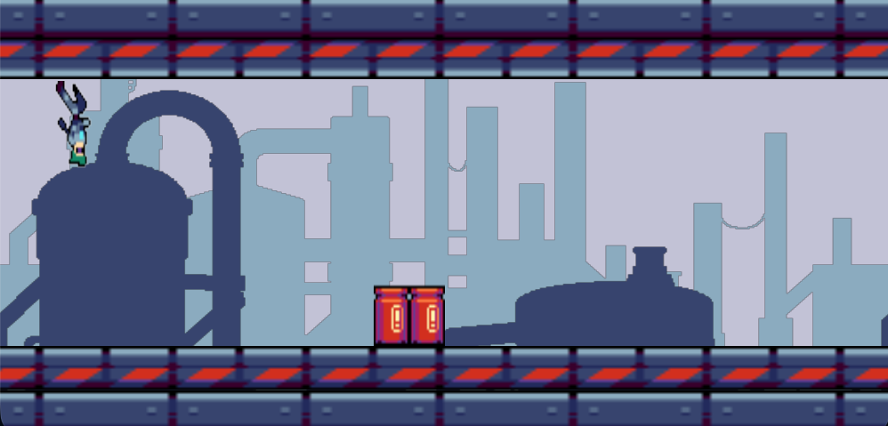

# ICS3U CPT – Interactive Processing Project

This repository contains your ICS3U Culminating Performance Task (CPT).

### Start here:
Please read the full project instructions in **[INSTRUCTIONS.md](INSTRUCTIONS.md)**.

Assessment criteria for this project are described in **[ASSESSMENT.md](ASSESSMENT.md)**.

Once you are ready to submit, replace the contents of this README.md file with:

# Gameplay

# Description of Program
This program is a small computer game titled "Gravity Rush." It is a single player, 16-bit, endless runner platformer, which sees a cyborg character jumping through sets of barrels. The game is set in an industrial themed level, and the core mechanic is the ability to swap the players gravity, allowing them to move on the ground or the ceiling. This allows them to ecsape obstacles easier. The game gradually increases in speed, making survival progressively more difficult.  

# User Interaction
The user guides the cyborg through obstacles using two controls. Firstly, the player presses the space button on the title screen to begin. Upon running, the UP arrow, or the space bar allows the character to jump, and holding the button for longer allows for a higher jump, giving the player control over jump height. Pressing the space bar flips the characters gravity, instantly switching them between running on the floor and the ceiling. If the character collides with a barrel, the game ends and results ina Game Over. Pressing the space bar results in the game restarting.

# Incomplete Features
Only barrel obstacles are present, which limits gameplay variety over longer runs.
The ceiling and floor barrel hitboxes are not perfectly tuned and may feel slightly off.
There is currently no score system to track survival time or distance.
Text renders wonky due to P2D graphics acceleration.

# External Assets
All assests from Craftpix.net free game assets.
https://craftpix.net/freebies/free-industrial-zone-tileset-pixel-art/
https://craftpix.net/freebies/free-3-cyberpunk-characters-pixel-art/

This README will be assessed as part of the project professionalism mark.
